# Allure Revision

The tool to parse allure-report and upload raw results to spreadsheet API.


**Outline:**
* [Setup](#setup)
* [Usage](#usage)
* [Arguments](#arguments)
* [Configuration](#configuration)


## Setup

* Extract spreadsheet ID
  * Create a new Google spreadsheet or open existing 
  * Open your spreadsheet, for example [https://docs.google.com/spreadsheets/d/1GOOG39g3lESP0rEADS5EeetIDtoE9XtRactAndUseE8/](https://docs.google.com/spreadsheets/d/1GOOG39g3lESP0rEADS5EeetIDtoE9XtRactAndUseE8/)
  * Find your spreadsheet ID in URL, which is `1GOOG39g3lESP0rEADS5EeetIDtoE9XtRactAndUseE8` in example
* Clone the project
```shell
git clone https://github.com/klvl/allure-revision
```
* Setup requirements
```shell
pip install -r allure-revision/requirements.txt
```
* Run a script
```shell
python3 main/make.py
```
* Grant allure-revision app with the access to your spreadsheet when a web browser is open
  * Login your Google account
  * Click on `Advanced` link, when a "Google hasn't verified this app" page is displayed
  * Click on `Go to allure-revision-app (unsafe)` link  
  * Click `Continue`

Congratulations! The refresh token is copied to your clipboard Follow [Usage](#usage) section for further usage


## Usage

Please, complete steps from the [Setup](#setup) section prior to use a tool

* Generate allure report
* Run revision
```shell
python3 main/make.py --report path/to/allure-report --id 1GOOG39g3lESP0rEADS5EeetIDtoE9XtRactAndUseE8 --token 1//079xMTmTOxNswPgXIANACGTcSNwF-O9Br9IEYQw7mKPzZJ9GT2i5e1qWvPGSTfqIdr44Is92yXZw8gEX-d2_JhIRGxNXNwBOonIw
```


## Arguments

### --report | Path to allure-report folder

If this argument is not specified, a script will search for it in current working
directory.

```shell
python3 main/make.py --report path/to/allure-report
```

### --id | Spreadsheet ID

To extract spreadsheet ID:
* Open your spreadsheet, for example [https://docs.google.com/spreadsheets/d/1GOOG39g3lESP0rEADS5EeetIDtoE9XtRactAndUseE8/](https://docs.google.com/spreadsheets/d/1GOOG39g3lESP0rEADS5EeetIDtoE9XtRactAndUseE8/)
* Find your spreadsheet ID in URL, which is `1GOOG39g3lESP0rEADS5EeetIDtoE9XtRactAndUseE8` in example

If `--id` argument is not specified, the script will look for the [id](#id-optional) parameter in config.json. If the
`id` is specified in config.json and is passed to a script as CLI argument, the value from CLI argument will be used.

```shell
python3 main/make.py --id 1GOOG39g3lESP0rEADS5EeetIDtoE9XtRactAndUseE8
```

### --token | Refresh token

You will find you in the script run output, after following steps in the [Setup](#setup) section. It is required to run
script without Google Authorization on web. If `--token` argument is not specified, the script will look for`--token`
parameter in config.json file, in current working directory.

```shell
python3 main/make.py --token 1//079xMTmTOxNswPgXIANACGTcSNwF-O9Br9IEYQw7mKPzZJ9GT2i5e1qWvPGSTfqIdr44Is92yXZw8gEX-d2_JhIRGxNXNwBOonIw
```

### --sheet | Sheet name

When you run a script, it creates new sheet in your spreadsheet. This argument sets a new sheet name. If `--sheet` 
argument is not specified, the name of new sheet will be named as current day and time in a format `MM/DD/YY | HH:MM:SS`.

```shell
python3 main/make.py --sheet build-7
```

### --config | Path to config

See [Config](#configuration) section to know more about a config. If the `--config` argument is not specified, the script will
search for it in current working directory. If the config.json is not found in current working directory, the script 
will use a [default config](#default-config).

```shell
python3 main/make.py --config path/to/config.json
```


## Configuration

There are different configuration options for allure-revision. It is possible to configure statuses of test cases in 
allure-report, columns in a spreadsheet, conditional formatting, dropdown menus and other. The config.json file is used
to configure it and this section describes how to do it.


### How to specify

There are different options to specify config:
* Run a script in directory where a config.json file exists
* Create a config.json file somewhere and run a script with [--config](#--config--path-to-config) argument, passing 
path to a file
* If a file is not present in working directory and [--config](#--config--path-to-config) argument is not specified, a 
[default config](#default-config) will be used


### id [optional]

To extract spreadsheet ID:
* Open your spreadsheet, for example [https://docs.google.com/spreadsheets/d/1GOOG39g3lESP0rEADS5EeetIDtoE9XtRactAndUseE8/](https://docs.google.com/spreadsheets/d/1GOOG39g3lESP0rEADS5EeetIDtoE9XtRactAndUseE8/)
* Find your spreadsheet ID in URL, which is `1GOOG39g3lESP0rEADS5EeetIDtoE9XtRactAndUseE8` in example

If `id` parameter is not specified, the script will look for the [--id](#--id--spreadsheet-id) CLI argument. If the 
`id` is specified in config.json and is passed to a script as CLI argument, the value from CLI argument will be used.

```json
{
  "id": "1GOOo39g3lESP0rEADS5EeetIDtoE9XtRactAndUseE8"
}
```


### token [optional]

The `token` parameter is a refresh token. Read where to find a spreadsheet ID in
[--token | Refresh token](#--token--refresh-token) section. If `token` is specified in a config.json and is passed as a 
CLI argument, the value from argument will be used.

```json
{
  "token": "1//079xMTmTOxNswPgXIANACGTcSNwF-O9Br9IEYQw7mKPzZJ9GT2i5e1qWvPGSTfqIdr44Is92yXZw8gEX-d2_JhIRGxNXNwBOonIw"
}
```


### statuses [mandatory]

The `statuses` array specifies which tests statuses it will get from allure report and upload to a spreadsheet. For 
example, if only "failed" status is specified, it will get only tests with "failed" status from allure report and upload
to a spreadsheet. The `statuses` array cannot be empty.

Supported values: "failed", "passed", "skipped", "broken", "unknown"

```json
{
  "statuses": ["failed", "broken"]
}
```


### newSheetIndex [optional]

The `newSheetIndex` specifies where to put sheet in a document. If this value is not specified, the new sheet is created
in the end of all sheets in a document.

```json
{
  "newSheetIndex": 0
}
```


### headerFormatting [optional]

The `headerFormatting` specifies the first row (header) formatting. The `headerFormatting.backgroundColor` specifies
a background color for header row. The `headerFormatting.foregroundColor` specifies the font color for header row. The
`headerFormatting.fontSize` specifies the font size for a header row. See available `backgroundColor` and 
`foregroundColor` values in a [Colors](#colors) section.

```json
{
  "headerFormatting": {
    "backgroundColor": "blue",
    "foregroundColor": "white",
    "fontSize": 11
  }
}
```


### columns [mandatory]

The `columns` is array of column json objects. It specifies the columns and its properties which will be displayed in 
allure report. The columns sequence in a spreadsheet should be defined in columns array from top to bottom. For example,
if you want to specify the 'REVISION' in the 2nd column of a spreadsheet, you should put its json object configuration
on the 2nd place of columns array. Read about column properties in the following sections. 

```json
{
  "columns": [
    {
      "name": "REVISION",
      "size": 100,
      "horizontalAlignment": "CENTER",
      "dropdown": ["fixed", "passed", "bug"],
      "conditionalFormatting": [
        {
          "color": "light_green",
          "ifValue": "fixed"
        },
        {
          "color": "light_green",
          "ifValue": "passed"
        },
        {
          "color": "red",
          "ifValue": "bug"
        }
      ]
    }
  ]
}
```

### columns.column.name [mandatory]

The `columns.column.name` is a column name which will be displayed in a spreadsheet.

```json
{
  "columns": [
    {
      "name": "TEST"
    }
  ]
}
```


### columns.column.size [optional]

The `columns.column.size` specifies a column size in a spreadsheet, in pixels.

```json
{
  "columns": [
    {
      "size": 100
    }
  ]
}
```


### columns.column.reportValue [optional]

The `columns.column.reportValue` specifies the information which we want to get from allure report and display in a
spreadsheet. If this value is not specified, the column will be a blank or with a
[dropdown](#columnscolumndropdown-optional) value if specified. The column cannot contain both options together
(`columns.column.reportValue` and `columns.column.dropdown`).

Supported values:
* "fullName" — full test name, e.g. com.package.TestClass.myTestMethodName
* "message" — failure message
* "shortMessage" — short failure message (will be displayed only the first line, before "\n")
* "category" — defect category
* "status" — test case status


```json
{
  "columns": [
    {
      "reportValue": "fullName"
    }
  ]
}
```


### columns.column.horizontalAlignment [optional]

The `columns.column.horizontalAlignment` specifies a horizontal alignment for all rows for a column.

Supported values: "LEFT", "CENTER", "RIGHT", "JUSTIFYLEFT"

```json
{
  "columns": [
    {
      "horizontalAlignment": "CENTER"
    }
  ]
}
```


### columns.column.dropdown [optional]

The `columns.column.dropdown` specifies array of dropdown values for all rows for a given column. The values are a free
string input. If this value is not specified, the column will be a blank or with a
[reportValue](#columnscolumnreportvalue-optional) value if specified. The column cannot contain both options together
(`columns.column.reportValue` and `columns.column.dropdown`). 

```json
{
  "columns": [
    {
      "dropdown": ["fixed", "passed", "bug"]
    }
  ]
}
```


### columns.column.conditionalFormatting [optional]

The `columns.column.conditionalFormatting` specifies array of conditional formatting rules. The 
`columns.column.conditionalFormatting.ifValue` specifies the text which triggers a conditional formatting. The 
`columns.column.conditionalFormatting.color` specifies a background color if the value from `ifValue` parameter is 
present in cell. According to example above, if in a given column, in any row, a cell value is "failed", then full row will have a red 
background color. 

The conditional formatting rules are unlimited. The `ifValue` is a free string value. See available colors in a 
[Colors](#colors) section.

```json
{
  "columns": [
    {
      "conditionalFormatting": [
        {
          "color": "red",
          "ifValue": "failed"
        }
      ]
    }
  ]
}
```


### Default config

If the path to config is not specified through [--config](#--config--path-to-config) CLI argument, and it is not present
in working directory, where the script is running from —— the default config will be used.

You can find a default config in the `default_config.json` file.


### Colors

See available color values below.

<div>
    <div>
        black:
    </div>
    
    <br>
    <div>
        white:
    </div>
    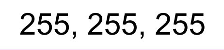
    <br>
    <div>
        grey:
    </div>
    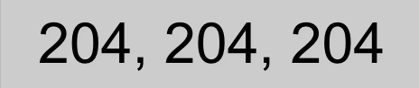
    <br>
    <div>
        light_grey:
    </div>
    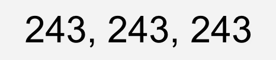
    <br>
    <div>
        red:
    </div>
    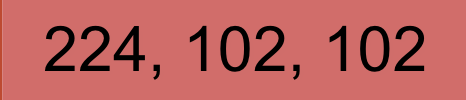
    <br>
    <div>
        light_red:
    </div>
    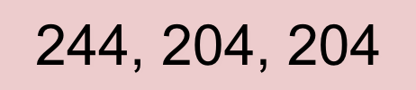
    <br>
    <div>
        orange:
    </div>
    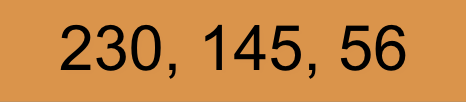
    <br>
    <div>
        light_orange:
    </div>
    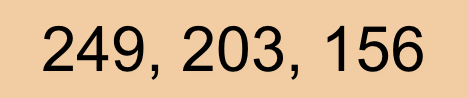
    <br>
    <div>
        yellow:
    </div>
    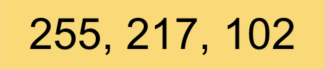
    <br>
    <div>
        light_yellow:
    </div>
    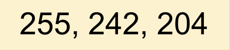
    <br>
    <div>
        green:
    </div>
    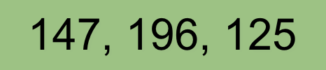
    <br>
    <div>
        light_green:
    </div>
    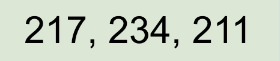
    <br>
    <div>
        blue:
    </div>
    
    <br>
    <div>
        light_blue:
    </div>
    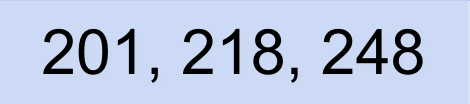
    <br>
    <div>
        purple:
    </div>
    
    <br>
    <div>
        light_purple:
    </div>
    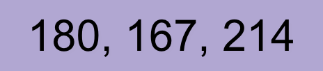
</div>